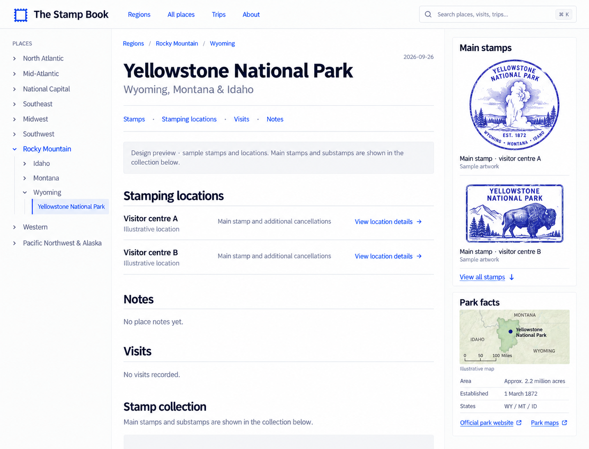
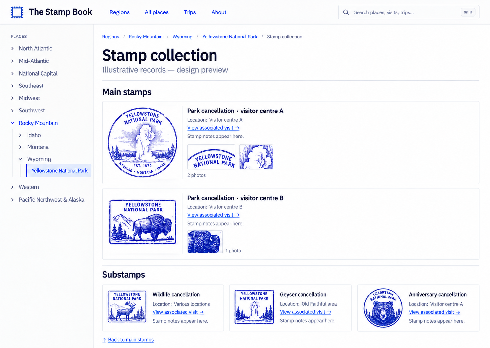
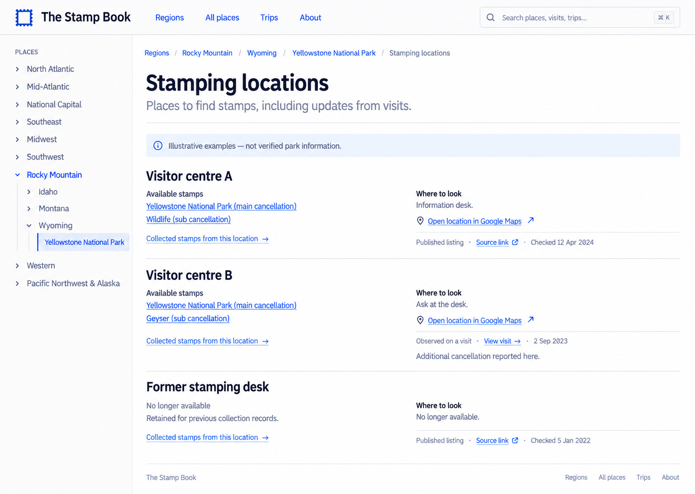

# Design handoff

Start here when continuing this project on another Codex host. All image links are relative and travel with the repository. These are design references, not deployed site assets.

## Latest design exploration — awaiting selection

The user rejected the photo-led direction because it depends too heavily on grand scenery, and asked to return to the Wikipedia-style sidebar with empty cancellation slots. Start with the [three revised sidebar studies](wiki-sidebar-return/README.md), each showing the same layout on a modest one-stamp battlefield and six-stamp Yellowstone. Preserve the left Places browser, small cancellations, locator map, classic typography and minimal collapsed stamping locations. Empty album spaces do not imply known missing stamp types. No replacement direction has been selected or implemented yet; the display-order mapping in that folder governs the next selection. The [previous ten-image exploration](single-stamp-exploration/README.md) is historical.

## Current implementation (under review)

**Previous implementation reference:** the user reselected `mockups/refinement-01-narrow-main-stamp-sidebar.png` after trying the Wikipedia variant. Its modern sans-serif typography, two separate sidebar cards, and locations → notes → visits → full collection desktop structure informed the current build, alongside the later 1200px cap, collapsible Places browser and horizontal collection grids. This layout is now under review; do not treat it as approval for further redesign. Earlier Wikipedia iteration notes below are historical.

The user explicitly requested a fully populated fictional Yellowstone page. `npm run qa:fixture` rebuilds the isolated preview at port 8767 with two June 2019 visits, two main stamps, four distinct substamps, an original diary inspired by the linked road-trip blog, and a credited NPS photograph of Lower Falls from Artist Point. This authorization applies to the demo only; the real `vault/` remains untouched. See [assets and sources](yellowstone-preview-assets.md) and `verification/yellowstone-filled-*.png`.

The selected design and stamping-location workflow are implemented on the local `design/modern-stamp-book` branch. See [implementation goal](implementation-goal.md), [location model and resolved decisions](location-model.md), [validation](verification/validation.md), and [design QA](../../design-qa.md). Production deployment remains deferred. The notes below preserve the design handoff and reference-image authority.

## Original handoff status and authority

The working site was published at `c30f54360175153e96ef4a909b0cff14af06bf5d`. At handoff, the following exploration had **not been implemented**. The user selected layout 2, then style 2 (modern documentation). They subsequently requested a narrower main-stamp sidebar, full collection mockups, and support for author-maintained stamping locations. The latest three images are complementary views of one place page, not competing alternatives.

The original request authorized packaging for transfer. The subsequent implementation goal authorized the redesign and location workflow; it does not authorize deployment or invented collection data. Textual requirements below override generated-image mistakes.

## Selected direction

- Clean modern documentation site, informed by [Tailscale Docs](https://tailscale.com/docs): white background, readable sans-serif typography, blue links, thin neutral rules and restrained borders.
- Stamps are the purpose of the site. Keep them prominent without allowing them to consume the reading column.
- Desktop target: approximately 240px left directory, flexible article, **280px right sidebar**. Main-stamp images approximately **200px maximum width**, aspect ratio preserved. Exact responsive CSS remains to be verified during implementation.
- Only `type: main` stamps appear in the top sidebar. Multiple main stamps stack vertically. **No substamps in this sidebar.**
- Park facts and a small locator map sit below the main stamps, with official NPS website, maps and planning links. Candidate facts: area, establishment date, states. Do not fabricate missing facts.
- The full collection section on the same page gives every main stamp and substamp its own name, photo(s), location, notes and link to the associated visit. Multiple photos must be supported.
- Use readable baselines: approximately 16px body, 15px navigation, 14px supporting text, 34–36px page title. Avoid returning to the current 10–12px UI labels. Treat these as proposed tokens, not validated accessibility guarantees.
- Retain one canonical page per place and the region → state → place tree. Multi-state places appear under applicable states but link to one page. Region headings lead to region overview pages.
- Preserve white surfaces; no paper textures, simulated scrapbook, marketing hero or statistics dashboard. No custom web editor. Content belongs on real pages or in-page sections, not overlay modals.
- Mobile should preserve readable text, contained stamp images and useful reading order. The approved mobile order is title/section links → main stamps and collection → locations → visits/notes → facts. Rendered mobile screenshots are in `verification/`.

## Latest complementary mockups

### Page top: narrow sidebar and stacked main stamps

### Further down the same page: full stamp collection

### Further down the same page: stamping locations

Image caveats: generated stamps, visitor centres, dates and map artwork are illustrative, not verified records. Some images include unsolicited dates, repeated explanatory copy, inconsistent counts or placeholder labels. Do not implement those literally. Section breadcrumbs in the lower-page images indicate context; they do not authorize additional routes. Sample banners belong to mockups, not the final product. No generated stamp art should populate the real collection.

## Stamping locations and Obsidian authorship

This extension is now implemented; its YAML schema and import reconciliation rules are documented in [location-model.md](location-model.md).

Separate availability information (where a stamp may be found) from collected impressions (what was collected during a visit). Keep place-related authorship in the existing place note.

Proposed Templater command: **Add/update stamping location**. Prompt for a human-readable location name, available stamps, where to look/access notes, availability, and website source or on-site observation. The existing **Add stamp** command should offer locations by name and allow adding a newly discovered one. Authors must never type IDs.

Published information needs a source URL and checked date. An on-site observation should reference its visit and inherit that visit's date: never enter the same visit date twice. Authored corrections and discoveries must survive later imports. Retain closed or moved locations for historical collection references. Distinguish reported availability from verified observations; do not present scraped data as infallible.

Website location sections should show available stamps, practical access notes, source/observation provenance, and links to collected stamps and the relevant visit. Optional Google Maps links are useful. The user explicitly does not want an in-app road-trip constructor.

Original planning decisions, now resolved in `location-model.md`: safe matching/renaming of locations without author-visible IDs; how multiple source claims and conflicts are retained; how repeat impressions of the same main stamp populate the sidebar; ordering/overflow for many main stamps; missing photos; mobile section order; stamp-specific vs location-wide availability. Do not silently overwrite historical collection snapshots when changing current availability.

## Exploration archive and exact option order

First round — layout:

1. [Encyclopedia](mockups/layout-01-encyclopedia.png)
2. [Stamps first — selected](mockups/layout-02-stamps-first-selected.png)
3. [Combined sidebar](mockups/layout-03-combined-sidebar.png)

Second round — whole-site styles:

1. [Traditional wiki](mockups/style-01-traditional-wiki.png)
2. [Modern documentation — selected](mockups/style-02-modern-docs-selected.png)
3. [Field guide](mockups/style-03-field-guide.png)
4. [Graphic catalogue](mockups/style-04-graphic-catalogue.png)
5. [Collection gallery](mockups/style-05-collection-gallery.png)

These historical directions are superseded by the selected modern documentation style plus the latest refinements. Do not mistake the first round's option 2 for the second round's option 2.

## Audit evidence and method

Used [Design Audit on skills.sh](https://www.skills.sh/bencium/bencium-marketplace/design-audit), installed from `bencium/bencium-marketplace`, path `design-audit/skills/design-audit`. Product Design ideation and ImageGen produced the mockups. The remote host may need to install/read that skill separately; it is not vendored here.

Captured references:

- [Current desktop entry](references/layout-before-desktop.png): tiny support text; floated infobox creates a large gap; duplicated visit empty states; oversized official-resources section.
- [Current mobile entry](references/layout-before-mobile.png): infobox pushes stamps far below the first screen; small navigation labels.
- [Current region overview](references/layout-before-region.png): small supporting text and repeated empty slots; preserve collection-book intent while improving legibility.
- [Tailscale docs](references/tailscale-docs-reference.png): visual reference for documentation hierarchy, not a request to clone its branding or features.

This was a focused visual review, not a comprehensive accessibility certification or complete audit of every page/state. Region, trip, search and mobile designs still need consistency checks when the selected design is implemented.

All 15 original PNGs are copied without modification. `assets.json` records SHA-256 checksums and original generated filenames for traceability.

## Subsequent width refinement

After reviewing the implementation, the user requested a calmer traditional web width. Use a **centered 1200px maximum width** for the page, header and footer. Collapse the directory at 1000px, keep the right-rail collapse at 1150px, and use fewer columns for secondary card grids. See [the updated capture](verification/desktop-traditional-width.png).

### Latest direction: Wikipedia article layout

The user's supplied Wikipedia screenshot supersedes the earlier modern documentation styling. Use serif article/section headings (Linux Libertine/Georgia/Times fallback), Arial body text, blue links, thin rules, collapsible Contents, a header Places drawer, and a simple park infobox. Omit Appearance controls. Keep the 1200px maximum width and approved mobile section order. Latest screenshots are in `verification/desktop-wikipedia-layout.png` and `verification/mobile-wikipedia-layout.png`.

Latest refinement: the left column is the collapsible Places browser, replacing Contents. Main stamps and substamps flow horizontally in responsive gallery grids. Updated captures: `verification/desktop-places-grid.png` and `verification/mobile-stamp-grid.png`.
